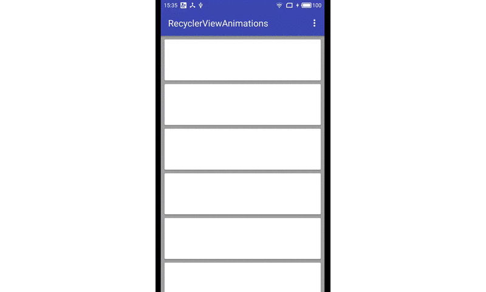
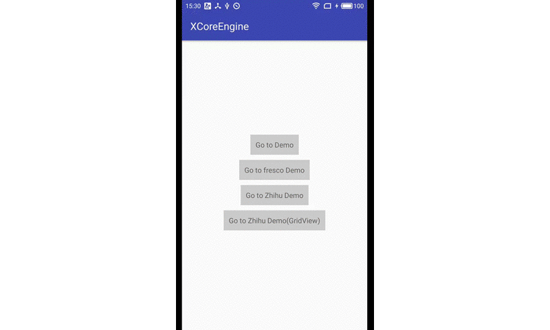

### 使用LayoutAnimationController为RecyclerView添加动画

[TOC]

#### 一、前言
为RecyclerView的Item添加动画有很多中方案，比如通过[设置setItemAnimator来实现](https://github.com/wasabeef/recyclerview-animators)或者是[通过遍历RecyclerView中的子View，然后分别对子View做动画](https://github.com/willowtreeapps/spruce-android)。今天介绍一种通过LayoutAnimation的方式，对RecyclerView的Item做动画。

#### 二、效果以及源码

Github源码：[]()

- 1.使用LayoutAnimationController
<br>

<br>
- 2.使用GridLayoutAnimationController
<br>

<br>
#### 三、实现方案

##### (1)LayoutAnimationController

比如实现从依次从左侧进入的动画效果，我们首先需要实现一个Item的动画效果，然后创建一个LayoutAnimationController对象，并设置每一个item播放动画的时间延时和item的播放顺序。

以从左侧进入为例，每个单独的Item的动画如下：

- 1.Item动画

```

    ...
    /**
     * 从左侧进入，并带有弹性的动画
     *
     * @return
     */
    public static AnimationSet getAnimationSetFromLeft() {
        AnimationSet animationSet = new AnimationSet(true);
        TranslateAnimation translateX1 = new TranslateAnimation(RELATIVE_TO_SELF, -1.0f, RELATIVE_TO_SELF, 0.1f,
                RELATIVE_TO_SELF, 0, RELATIVE_TO_SELF, 0);
        translateX1.setDuration(300);
        translateX1.setInterpolator(new DecelerateInterpolator());
        translateX1.setStartOffset(0);

        TranslateAnimation translateX2 = new TranslateAnimation(RELATIVE_TO_SELF, 0.1f, RELATIVE_TO_SELF, -0.1f,
                RELATIVE_TO_SELF, 0, RELATIVE_TO_SELF, 0);
        translateX2.setStartOffset(300);
        translateX2.setInterpolator(new DecelerateInterpolator());
        translateX2.setDuration(50);

        TranslateAnimation translateX3 = new TranslateAnimation(RELATIVE_TO_SELF, -0.1f, RELATIVE_TO_SELF, 0f,
                RELATIVE_TO_SELF, 0, RELATIVE_TO_SELF, 0);
        translateX3.setStartOffset(350);
        translateX3.setInterpolator(new DecelerateInterpolator());
        translateX3.setDuration(50);

        animationSet.addAnimation(translateX1);
        animationSet.addAnimation(translateX2);
        animationSet.addAnimation(translateX3);
        animationSet.setDuration(400);

        return animationSet;
    }
    ...
```

为了让Item看起来有‘弹性’效果，animationSet添加了三个移动动画，分别是从左侧进入(-100%)，移动到右侧的10%,然后在从右侧(10%)移动到左侧(-10%),最后再从(-10%)移动到原本的位置(0%)。这样就有了移动后的弹性效果。

- 2.设置LayoutAnimationController的属性

2.1 设置ViewGroup的子View播放动画之间的offset。

```
/**
 * Sets the delay, as a fraction of the animation duration, by which the children's animations are offset.
 */
void setDelay(float delay)

```

2.2 设置ViewGroup的子View播放动画的顺序

```
/**
 * Sets the order used to compute the delay of each child's animation.
 */
void setOrder(int order)
```

setOrder可以取值为LayoutAnimationController.ORDER_NORMAL(正常顺序)，LayoutAnimationController.ORDER_RANDOM(随机顺序)以及LayoutAnimationController.ORDER_REVERSE(逆序)。这里的demo设置的是正常顺序。

- 3.播放动画

```
   /**
     * 播放RecyclerView动画
     *
     * @param animation
     * @param isReverse
     */
    public void playLayoutAnimation(Animation animation, boolean isReverse) {
        LayoutAnimationController controller = new LayoutAnimationController(animation);
        controller.setDelay(0.1f);
        controller.setOrder(isReverse ? LayoutAnimationController.ORDER_REVERSE : LayoutAnimationController.ORDER_NORMAL);

        mRecyclerView.setLayoutAnimation(controller);
        mRecyclerView.getAdapter().notifyDataSetChanged();
        mRecyclerView.scheduleLayoutAnimation();
    }
```

通过viewGroup.setLayoutAnimation设置layout动画。然后通知ViewGroup重新绘制，调用scheduleLayoutAnimation方法播放动画。

##### (2)GridLayoutAnimationController

上述方法针对的是线性的RecyclerView，也就是说RecyclerView的LayoutManager设置的是LinearLayoutManager.

```
    ...
    @Override
    protected void onCreate(Bundle savedInstanceState) {
        super.onCreate(savedInstanceState);
        setContentView(R.layout.activity_main_list);
        Toolbar toolbar = (Toolbar) findViewById(R.id.toolbar);
        setSupportActionBar(toolbar);

        mRecyclerView = (RecyclerView) findViewById(R.id.recycler_view);
        mRecyclerView.setLayoutManager(new LinearLayoutManager(this));
        mRecyclerView.setAdapter(new DemoRecyclerViewAdapter());
    }
    ...

```

而对于使用GridLayoutManager和StaggeredGridLayoutManager的RecyclerView来说，我们需要使用GridLayoutAnimationController，其他步骤与LayoutAnimationController一致。

```
    ...
    @Override
    protected void onCreate(Bundle savedInstanceState) {
        super.onCreate(savedInstanceState);
        setContentView(R.layout.activity_main_grid);
        Toolbar toolbar = (Toolbar) findViewById(R.id.toolbar);
        setSupportActionBar(toolbar);

        mRecyclerView = (StaggeredGridRecyclerView) findViewById(R.id.recycler_view);
        mRecyclerView.setLayoutManager(new StaggeredGridLayoutManager(2, StaggeredGridLayoutManager.VERTICAL));
        mStaggeredGridAdapter = new StaggeredGridAdapter();
        mStaggeredGridAdapter.setDataSet(mockData());
        mRecyclerView.setAdapter(mStaggeredGridAdapter);
    }

    ....
```

同样的，仍然使用之前的Animation创建GridLayoutAnimationController。

```
   ...
   /**
     * 播放动画
     *
     * @param animation
     * @param isReverse
     */
    public void playLayoutAnimation(Animation animation, boolean isReverse) {
        GridLayoutAnimationController controller = new GridLayoutAnimationController(animation);
        controller.setColumnDelay(0.2f);
        controller.setRowDelay(0.3f);
        controller.setOrder(isReverse ? LayoutAnimationController.ORDER_REVERSE : LayoutAnimationController.ORDER_NORMAL);

        mRecyclerView.setLayoutAnimation(controller);
        mRecyclerView.getAdapter().notifyDataSetChanged();
        mRecyclerView.scheduleLayoutAnimation();
    }
    ...
```

GridLayoutAnimationController的delay方法可以分别按照Column和Row维度进行设置。

本以为到此顺利结束。运行后发现，会Crash，log为：

```
...
E/AndroidRuntime( 7876): java.lang.ClassCastException: android.view.animation.LayoutAnimationController$AnimationParameters cannot be cast to android.view.animation.GridLayoutAnimationController$AnimationParameters
E/AndroidRuntime( 7876): 	at android.view.animation.GridLayoutAnimationController.getDelayForView(GridLayoutAnimationController.java:299)
E/AndroidRuntime( 7876): 	at android.view.animation.LayoutAnimationController.getAnimationForView(LayoutAnimationController.java:321)
E/AndroidRuntime( 7876): 	at android.view.ViewGroup.bindLayoutAnimation(ViewGroup.java:4227)
E/AndroidRuntime( 7876): 	at android.view.ViewGroup.dispatchDraw(ViewGroup.java:3272)
E/AndroidRuntime( 7876): 	at android.view.View.draw(View.java:15618)
E/AndroidRuntime( 7876): 	at android.support.v7.widget.RecyclerView.draw(RecyclerView.java:3869)
E/AndroidRuntime( 7876): 	at android.view.View.updateDisplayListIfDirty(View.java:14495)
E/AndroidRuntime( 7876): 	at android.view.View.getDisplayList(View.java:14524)
E/AndroidRuntime( 7876): 	at android.view.View.draw(View.java:15315)
E/AndroidRuntime( 7876): 	at android.view.ViewGroup.drawChild(ViewGroup.java:3536)
E/AndroidRuntime( 7876): 	at android.view.ViewGroup.dispatchDraw(ViewGroup.java:3329)
E/AndroidRuntime( 7876): 	at android.view.View.draw(View.java:15618)
E/AndroidRuntime( 7876): 	at android.view.View.updateDisplayListIfDirty(View.java:14495)
E/AndroidRuntime( 7876): 	at android.view.View.getDisplayList(View.java:14524)
...
```

为了解决这个问题，我们需要override RecyclerView的attachLayoutAnimationParameters方法：

```
package com.github.nuptboyzhb.recyclerviewanimation.grid;

import android.content.Context;
import android.support.annotation.Nullable;
import android.support.v7.widget.GridLayoutManager;
import android.support.v7.widget.RecyclerView;
import android.support.v7.widget.StaggeredGridLayoutManager;
import android.util.AttributeSet;
import android.view.View;
import android.view.ViewGroup;
import android.view.animation.GridLayoutAnimationController;

/**
 * @version Created by haibozheng on 2016/12/9.
 * @Author Zheng Haibo
 * @Blog github.com/nuptboyzhb
 * @Company Alibaba Group
 * @Description StaggeredGridRecyclerView
 */
public class StaggeredGridRecyclerView extends RecyclerView {

    public StaggeredGridRecyclerView(Context context) {
        super(context);
    }

    public StaggeredGridRecyclerView(Context context, @Nullable AttributeSet attrs) {
        super(context, attrs);
    }

    public StaggeredGridRecyclerView(Context context, @Nullable AttributeSet attrs, int defStyle) {
        super(context, attrs, defStyle);
    }

    /**
     * 支持GridLayoutManager以及StaggeredGridLayoutManager
     *
     * @param child
     * @param params
     * @param index
     * @param count
     */
    @Override
    protected void attachLayoutAnimationParameters(View child, ViewGroup.LayoutParams params,
                                                   int index, int count) {
        LayoutManager layoutManager = this.getLayoutManager();
        if (getAdapter() != null && (layoutManager instanceof GridLayoutManager
                || layoutManager instanceof StaggeredGridLayoutManager)) {

            GridLayoutAnimationController.AnimationParameters animationParams =
                    (GridLayoutAnimationController.AnimationParameters) params.layoutAnimationParameters;

            if (animationParams == null) {
                animationParams = new GridLayoutAnimationController.AnimationParameters();
                params.layoutAnimationParameters = animationParams;
            }

            int columns = 0;
            if (layoutManager instanceof GridLayoutManager) {
                columns = ((GridLayoutManager) layoutManager).getSpanCount();
            } else {
                columns = ((StaggeredGridLayoutManager) layoutManager).getSpanCount();
            }

            animationParams.count = count;
            animationParams.index = index;
            animationParams.columnsCount = columns;
            animationParams.rowsCount = count / columns;

            final int invertedIndex = count - 1 - index;
            animationParams.column = columns - 1 - (invertedIndex % columns);
            animationParams.row = animationParams.rowsCount - 1 - invertedIndex / columns;

        } else {
            super.attachLayoutAnimationParameters(child, params, index, count);
        }
    }
}
```

更多动画效果，请参见Github源码：[]()

#### 四、总结
通过LayoutAnimationController或者GridLayoutAnimationController来实现RecyclerView的动画，非常简单，而且效果很好。该方式不仅可以应用于RecyclerView，而且还适用于ListView、LinearLayout、GridView等ViewGroup。比如，如下是作用在一个LinearLayout的效果。
<br>

<br>


